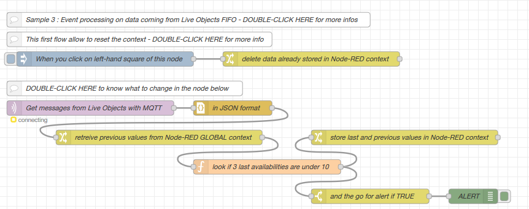

# node-red-orange-iot-samples 

## Presentation 

node-red-orange-iot-samples gives some explanations on default samples you will find while accessing Live Objects Node-RED option.

## Data transformation using Live Objects and Node-RED

Node-RED, the popular open source under Apache 2.0 license, has been integrated in SaaS mode within Live Objects, to allow users to describe and execute, through a flow graphical editor, their own data transformation treatments: format adaptation, decoder, data enrichment and more depending on users' needs and imagination.

See https://nodered.org/ to discover what Node-RED is.

To be able to use Node-RED features, ask your vendor for an access: you will receive a mail with your account and the URL to use Node-RED option.

Using this account, you can log-in the Node-RED SaaS page:


When opening the editor, you will find 3 treatments (called **flows** in Node-RED vocabulary) samples in the "Default samples" tab:


You can either use this documentation, or follow embedded comments to do your first steps using Node-RED in link with Live Objects:
- *Getting data from a Live Objects MQTT topic (application mode)*, to base Node-RED treatment on data coming from Live Objects (through MQTT)
- *Sending data to a Live Objects MQTT topic (device mode)*, to send data transformed by Node-RED to Live Objects (through MQTT)
- *Sample 1: pushing to Live Objects data collected from a bike station*
- *Sample 2: enriching data, using Live Objects custom pipeline feature*
- *Sample 3: event processing on data coming from Live Objects*

See also https://nodered.org/docs/ to learn more about Node-RED use.

Note that in this SaaS implementation, Node-RED context is stored in database, to be persistent even in the case of a start/stop of the platform. Therefore, you have to use asynchronous mode (https://nodered.org/docs/user-guide/writing-functions#asynchronous-context-access) to access this context (here we used "change" nodes).

## Getting data from a Live Objects MQTT topic (application mode)

In Node-RED editor, use an "mqtt out" node, and position it on an existing Live Objects FIFO:


MQTT address and port are to be set:


With your API-KEY, of "Application" profile in Live Objects:


When saved, your node should appear connected :


You can start to create your Flow by importing (Ctrl-I) the following source (note that you will have to put your own API-KEY in "Password" field of Node-RED screen above):

```
[{"id":"2ac0690f.f3f8f6","type":"mqtt in","z":"d1ebc1de.552d58","name":"","topic":"fifo/myFIFO","qos":"2","datatype":"auto","broker":"fee6051f.6515","x":110,"y":120,"wires":[[]]},{"id":"fee6051f.6515","type":"mqtt-broker","z":"","name":"Live Objects Application","broker":"liveobjects.orange-business.com","port":"1883","tls":"5b95170f.22b128","clientid":"myapp_id","usetls":false,"compatmode":true,"keepalive":"30","cleansession":true,"birthTopic":"","birthQos":"0","birthPayload":"","closeTopic":"","closeQos":"0","closePayload":"","willTopic":"","willQos":"0","willPayload":""},{"id":"5b95170f.22b128","type":"tls-config","z":"","name":"","cert":"","key":"","ca":"","certname":"","keyname":"","caname":"","servername":"","verifyservercert":false}]
```

## Sending data to a Live Objects MQTT topic (device mode)

In Node-RED editor, use an mqtt out node, and position it on an existing Live Objects FIFO:


Edit the different property (connection and security) of your MQTT topic, giving the device ID which will appear in Live Objects (here urn:lo:nsid:mqttnodered:my_device):


When saved, your node should appear connected :


You can start to create your Flow by importing (Ctrl-I) the following source (note that you will have to put your own device API-KEY in "Password" field of Node-RED screen above):

```
[{"id":"d6ad7974.b19d5","type":"tab","label":"Flow 2","disabled":false,"info":""},{"id":"ddfc4322.32aec","type":"mqtt out","z":"d6ad7974.b19d5","name":"publish to dev/data","topic":"dev/data","qos":"0","retain":"","broker":"fee6051f.6515","x":170,"y":140,"wires":[]},{"id":"fee6051f.6515","type":"mqtt-broker","z":"","name":"Live Objects Device","broker":"liveobjects.orange-business.com","port":"1883","tls":"5b95170f.22b128","clientid":"urn:lo:nsid:mqttnodered:my_device","usetls":false,"compatmode":true,"keepalive":"30","cleansession":true,"birthTopic":"","birthQos":"0","birthPayload":"","closeTopic":"","closeQos":"0","closePayload":"","willTopic":"","willQos":"0","willPayload":""},{"id":"5b95170f.22b128","type":"tls-config","z":"","name":"","cert":"","key":"","ca":"","certname":"","keyname":"","caname":"","servername":"","verifyservercert":false}]
```

## Sample 1: pushing to Live Objects data collected from a bike station

This sample get every 30 minutes information from 1 bike station in Paris (velib), and push them, as message from devices, to Live Objects:


Put your API KEY in "mqtt out" node as explained above in order to run this sample.

## Sample 2: enriching data, using Live Objects custom pipeline feature

*Creation of the custom pipeline*

The custom pipeline mechanism of Live Objects is detailled in Live Objects documentation https://liveobjects.orange-business.com/doc/html/lo_manual_v2.html#PIPELINES). 

The creation of the custom pipeline can be done by Live Objects portal:
- Click on "Add" in "Data"/"Custom pipelines" menu
- Add an "External transformation" and :
 - Set URL with **<your Node-RED API URL that you received by mail>/transform**
 - Set "HTTP Header key" to "Authorization"
 - Encode in base-64 **<your login>:<your password>** (for instance using https://www.base64encode.org/).
 - Set "HTTP Header value" with **Basic <the encoding value>**


  

*Preparation of the call of Live Objects API to create the pipeline is done in "function" node*


And then, you can call the API with "http request" node:


*Treatment to be called by custom pipeline*

You can then define a flow that will be called when Live Objects receives messages, depending on the conditions you have set in the definition of your custom pipeline.

In the example below, we use the treatment called by custom pipeline to add in the stream of data that will be stored by Live Objects, external temperature value, get from an Internet API.


To fit with the definition of the custom pipeline done above, you first have to use a "http in" node, and name it accordingly (here "transform").


Then you can add the temperature value (here converted from Kelvin to Degree) in the payload that will be returned to Live Objects by the "http response" node:


You can start to create your Flow by importing (Ctrl-I) the following source (note that you will have to put your own API-KEYs):

```
[{"id":"91b958b6.9af578","type":"tab","label":"[e] Pipeline","disabled":false,"info":""},{"id":"eb2c2a85.5abf8","type":"http in","z":"91b958b6.9af578","name":"transform","url":"/transform","method":"post","upload":false,"swaggerDoc":"","x":100,"y":180,"wires":[["28317e7.4a6b082"]]},{"id":"afa96237.91ba2","type":"http response","z":"91b958b6.9af578","name":"","statusCode":"","headers":{},"x":650,"y":180,"wires":[]},{"id":"28317e7.4a6b082","type":"function","z":"91b958b6.9af578","name":"store initial msg","func":"msg.request = msg.payload;\nmsg.nom_arrondissement_communes = msg.payload.value.nom_arrondissement_communes;\n//msg.lat = msg.payload.location.lat;\n//msg.lon = msg.payload.location.lon;\nreturn msg;","outputs":1,"noerr":0,"x":180,"y":240,"wires":[["b96bc50a.fcd9d"]]},{"id":"55fabfa.e9ec64","type":"http request","z":"91b958b6.9af578","name":"","method":"use","ret":"txt","paytoqs":false,"url":"","tls":"","persist":false,"proxy":"","authType":"","x":410,"y":80,"wires":[["969f4c73.a2091"]]},{"id":"efd15f88.c548f8","type":"inject","z":"91b958b6.9af578","name":"","topic":"","payload":"{\"enabled\":true,\"name\":\"test pipeline\",\"priorityLevel\":0,\"steps\":[{\"type\":\"externalTransformation\",\"name\":\"appspot data enricher\",\"url\":\"https://node-red-1-nodered-enabler-prod.eu-b.kmt.orange.com/node-red/api/5e8dc6b44311625edbefa554/transform\",\"headers\":{\"Authorization\":[\"Basic ===APIKEY===\"]}}]}","payloadType":"json","repeat":"","crontab":"","once":false,"onceDelay":0.1,"x":110,"y":80,"wires":[["dbb55649.2d4a1"]]},{"id":"dbb55649.2d4a1","type":"function","z":"91b958b6.9af578","name":"set URL","func":"msg.headers = {};\nmsg.headers['Content-Type'] = 'application/json';\nmsg.headers['Accept'] = 'application/json';\nmsg.headers['X-API-KEY'] = 'xxxxxxxxxxxxxxxxxxxxxxxxxxxxxxxx';\n\nmsg.method = \"POST\";\n\nmsg.url = \"https://liveobjects.orange-business.com/api/v0/pipelines\";\n\nreturn msg;","outputs":1,"noerr":0,"x":260,"y":80,"wires":[["55fabfa.e9ec64"]]},{"id":"969f4c73.a2091","type":"debug","z":"91b958b6.9af578","name":"","active":true,"tosidebar":true,"console":false,"tostatus":false,"complete":"false","x":590,"y":80,"wires":[]},{"id":"ca3a29f4.b50708","type":"comment","z":"91b958b6.9af578","name":"Pipeline creation (on shot call)","info":"","x":160,"y":40,"wires":[]},{"id":"425ec7ff.ea76d8","type":"comment","z":"91b958b6.9af578","name":"Transformation called by the custom pipeline to enrich device data (here {{city}} T°)","info":"","x":330,"y":140,"wires":[]},{"id":"b96bc50a.fcd9d","type":"http request","z":"91b958b6.9af578","name":"","method":"GET","ret":"obj","paytoqs":false,"url":"http://api.openweathermap.org/data/2.5/weather?q={{nom_arrondissement_communes}},fr&appid=XXXXXXX","tls":"","persist":false,"proxy":"","authType":"","x":370,"y":240,"wires":[["d63aa8d5.e2319"]]},{"id":"d63aa8d5.e2319","type":"function","z":"91b958b6.9af578","name":"Add temperature","func":"msg.tmp = msg.payload;\nmsg.payload = msg.request;\n\nmsg.payload.value.temperature = msg.tmp.main.temp - 273.15;\n\nreturn msg;","outputs":1,"noerr":0,"x":550,"y":240,"wires":[["afa96237.91ba2"]]}]
```

Note that this URL may differs in your case. Use the one received in the welcome mail.


## Sample 3: event processing on data coming from Live Objects

This sample retrieves data from Live Objects (North bound interface), to execute an event processing treatment:

* Based on data coming from several devices
* Using persistent context (*)

Especially with these features, Node-RED is complementary to what is provided directly by Live Objects native Event Processing mechanisms.

(*): Note that Node-RED context is stored in database, to be persistent even in the case of a start/stop of the platform. Therefore, you have to use asynchronous mode (https://nodered.org/docs/user-guide/writing-functions#asynchronous-context-access) to access this context (here we used "change" nodes).



You can start to create your Flow by importing (Ctrl-I) the following source (note that you will have to put your own API-KEY):

```
[{"id":"7ef560d1.b5be08","type":"tab","label":"[p] Velib alert","disabled":false,"info":""},{"id":"afe49b9c.d12818","type":"mqtt in","z":"7ef560d1.b5be08","name":"","topic":"fifo/vantiqFifo","qos":"2","datatype":"auto","broker":"f06f3a34.82ea7","x":90,"y":160,"wires":[["395a761c.b8da4a"]]},{"id":"395a761c.b8da4a","type":"json","z":"7ef560d1.b5be08","name":"","property":"payload","action":"obj","pretty":false,"x":230,"y":160,"wires":[["978ebb43.458298"]]},{"id":"8c1a9d4f.e0932","type":"debug","z":"7ef560d1.b5be08","name":"","active":true,"tosidebar":true,"console":false,"tostatus":true,"complete":"total","targetType":"msg","x":380,"y":360,"wires":[]},{"id":"3a785286.5be31e","type":"function","z":"7ef560d1.b5be08","name":"sum availabilities","func":"// get values from msg\nvar numbikes = msg.payload.value.numbikesavailable;\nvar name = msg.payload.value.name;\n\n// update availability array\nif (msg.availability === null ) msg.availability={};\nvar availability = msg.availability;\navailability[name]=numbikes;\n\n// calculate total availability\nvar total = 0;\nObject.keys(availability).forEach(k=>{node.warn(k+' => '+availability[k]); total += availability[k]})\n//node.warn(\"total : \" + total);\n\nmsg.payload = msg.payload + \"|\" + availability[\"Pernety - Raymond Losserand\"] + \"|\" + availability[\"Marne - Charles de Gaulle\"] + \"|\";\nmsg.total = total;\n\n//msg.topic   = name; // mandatory for charts to display a label\n\nreturn msg;","outputs":1,"noerr":0,"x":330,"y":300,"wires":[["8c1a9d4f.e0932","f9371a6e.33397","68e60697.17fa88"]]},{"id":"f9371a6e.33397","type":"change","z":"7ef560d1.b5be08","name":"set context","rules":[{"t":"set","p":"availability","pt":"global","to":"availability","tot":"msg"}],"action":"","property":"","from":"","to":"","reg":false,"x":530,"y":240,"wires":[[]]},{"id":"978ebb43.458298","type":"change","z":"7ef560d1.b5be08","name":"get context","rules":[{"t":"set","p":"availability","pt":"msg","to":"availability","tot":"global"}],"action":"","property":"","from":"","to":"","reg":false,"x":230,"y":240,"wires":[["3a785286.5be31e"]]},{"id":"7189df10.cb8a9","type":"inject","z":"7ef560d1.b5be08","name":"","topic":"","payload":"","payloadType":"date","repeat":"","crontab":"","once":false,"onceDelay":0.1,"x":100,"y":60,"wires":[["44087f0b.d3522"]]},{"id":"44087f0b.d3522","type":"change","z":"7ef560d1.b5be08","name":"","rules":[{"t":"delete","p":"availability","pt":"global"}],"action":"","property":"","from":"","to":"","reg":false,"x":290,"y":60,"wires":[[]]},{"id":"7a12ba0d.dbbd24","type":"inject","z":"7ef560d1.b5be08","name":"For test","topic":"","payload":"{\"value\":{\"name\":\"Lans-en-Vercors\",\"numbikesavailable\":5}}","payloadType":"json","repeat":"","crontab":"","once":false,"onceDelay":0.1,"x":70,"y":360,"wires":[["978ebb43.458298"]]},{"id":"68e60697.17fa88","type":"switch","z":"7ef560d1.b5be08","name":"if > 100","property":"total","propertyType":"msg","rules":[{"t":"gt","v":"100","vt":"num"},{"t":"lte","v":"100","vt":"num"}],"checkall":"true","repair":false,"outputs":2,"x":520,"y":300,"wires":[["bf5ea7.9061b158","bdf99d96.aef4f8"],["474365d6.a0c29c"]]},{"id":"bf5ea7.9061b158","type":"debug","z":"7ef560d1.b5be08","name":"ALERT ","active":true,"tosidebar":true,"console":false,"tostatus":true,"complete":"\"ALERT\"","targetType":"jsonata","x":690,"y":340,"wires":[]},{"id":"474365d6.a0c29c","type":"debug","z":"7ef560d1.b5be08","name":"DO NOTHING","active":true,"tosidebar":true,"console":false,"tostatus":true,"complete":"\"DO NOTHING\"","targetType":"jsonata","x":720,"y":420,"wires":[]},{"id":"d56de42b.48f7c","type":"http request","z":"7ef560d1.b5be08","name":"","method":"use","ret":"txt","paytoqs":false,"url":"","tls":"","persist":false,"proxy":"","authType":"","x":1010,"y":300,"wires":[[]]},{"id":"bdf99d96.aef4f8","type":"template","z":"7ef560d1.b5be08","name":"set mail","field":"payload","fieldType":"msg","format":"handlebars","syntax":"mustache","template":"{\n \"contact\": \n  {\n    \"to\": [\n      \"jeanmichel.ortholand@orange.com\"\n    ]\n  },\n  \"message\": {\n     \"title\": \"Hello\",\n     \"content\": \"Hello World !\"\n  }\n}\n","output":"json","x":700,"y":300,"wires":[["99cc3663.80423"]]},{"id":"99cc3663.80423","type":"function","z":"7ef560d1.b5be08","name":"set request","func":"msg.headers = {};\nmsg.headers['Content-Type'] = 'application/json';\nmsg.headers['Accept'] = 'application/json';\nmsg.headers['X-API-KEY'] = '==APIKEY==';\n\nmsg.method = \"POST\";\n\nmsg.url = \"https://liveobjects.orange-business.com/api/v0/contact\";\n\nreturn msg;","outputs":1,"noerr":0,"x":850,"y":300,"wires":[["d56de42b.48f7c"]]},{"id":"18bc76ce.073371","type":"comment","z":"7ef560d1.b5be08","name":"This first flow allow to reset the context","info":"","x":170,"y":20,"wires":[]},{"id":"b9afd010.07d958","type":"comment","z":"7ef560d1.b5be08","name":"Get from Live Objects velib stations availabilities to sum and alert if sum > 100","info":"","x":290,"y":120,"wires":[]},{"id":"7207641a.4fc44c","type":"comment","z":"7ef560d1.b5be08","name":"Dummy station to test","info":"","x":120,"y":320,"wires":[]},{"id":"d32d73e.227a41","type":"comment","z":"7ef560d1.b5be08","name":"Format and send a mail with Live Objects if sum > 100","info":"","x":840,"y":260,"wires":[]},{"id":"f06f3a34.82ea7","type":"mqtt-broker","z":"","name":"Live Objects Device","broker":"liveobjects.orange-business.com","port":"8883","tls":"e7258cda.0b59a8","clientid":"urn:lo:nsid:mqttnodered:my_device","usetls":true,"compatmode":true,"keepalive":"30","cleansession":true,"birthTopic":"","birthQos":"0","birthPayload":"","closeTopic":"","closeQos":"0","closePayload":"","willTopic":"","willQos":"0","willPayload":""},{"id":"e7258cda.0b59a8","type":"tls-config","z":"","name":"","cert":"","key":"","ca":"","certname":"","keyname":"","caname":"","servername":"","verifyservercert":false}]
```

