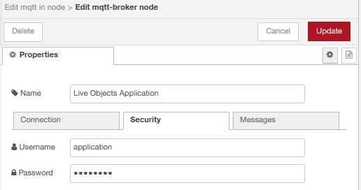

# node-red-orange-iot-samples 

node-red-orange-iot-samples gives some explanations on default samples you will find while accessing Live Objects Node-RED option.

## Table of contents

- [Data transformation using Live Objects and Node-RED](#data-transformation-using-live-objects-and-node-red)
- [Node addition request](#node-addition-request)
- [Getting data from a Live Objects Application mode MQTT topic](#getting-data-from-a-live-objects-application-mode-mqtt-topic)
- [Sending data to a Live Objects Device mode MQTT topic](#sending-data-to-a-live-objects-device-mode-mqtt-topic)
- [Sample 1: pushing to Live Objects data collected from a bike station](#sample-1-pushing-to-live-objects-data-collected-from-a-bike-station)
- [Sample 2: enriching data, using Live Objects custom pipeline feature](#sample-2-enriching-data-using-live-objects-custom-pipeline-feature)
- [Sample 3: event processing on data coming from Live Objects](#sample-3-event-processing-on-data-coming-from-live-objects)

## Data transformation using Live Objects and Node-RED

Node-RED, the popular open source under Apache 2.0 license, has been integrated in SaaS mode within Live Objects, to allow users to describe and execute, through a flow graphical editor, their own data transformation treatments: format adaptation, decoder, data enrichment and more depending on users' needs and imagination.

See https://nodered.org/ to discover what Node-RED is.

To be able to use Node-RED features, ask your vendor for an access: you will receive a mail with your account and the URL to use Node-RED option.

Using this account, you can log-in the Node-RED SaaS page:


API login and password are to be used :
- when you want to call by HTTP a Node-RED flow from outside of Node-RED,
- when you want to log in a portal made with dashboard Node-RED nodes.

When opening the editor, you will find 3 treatments (called **flows** in Node-RED vocabulary) samples in the "Default samples" tab:


See also https://nodered.org/docs/ to learn more about Node-RED use.

Note that in this SaaS implementation, Node-RED context is stored in database, to be persistent even in the case of a start/stop of the platform. Therefore, you have to use asynchronous mode (https://nodered.org/docs/user-guide/writing-functions#asynchronous-context-access) to access this context (here we used "change" nodes).

## Node addition request

You can contact support to request for node addition in the palette, especially coming from https://flows.nodered.org/. Orange will do a security check on this node, and if safe, will add them in the palette of every Node-RED user.

Note that Orange garranties only Node-RED native nodes. Orange hotline supports you only on the use of these native nodes.

## Getting data from a Live Objects Application mode MQTT topic

In Node-RED editor, use an "mqtt out" node, and position it on an existing Live Objects FIFO:


MQTT address and port are to be set:


With your API-KEY, of "Application" profile in Live Objects:



When saved, your node should appear connected :


You can start to create your Flow by importing (Ctrl-I) the following source (note that you will have to put your own API-KEY in "Password" field of Node-RED screen above):

```
[{"id":"2ac0690f.f3f8f6","type":"mqtt in","z":"d1ebc1de.552d58","name":"","topic":"fifo/myFIFO","qos":"2","datatype":"auto","broker":"fee6051f.6515","x":110,"y":120,"wires":[[]]},{"id":"fee6051f.6515","type":"mqtt-broker","z":"","name":"Live Objects Application","broker":"liveobjects.orange-business.com","port":"1883","tls":"5b95170f.22b128","clientid":"myapp_id","usetls":false,"compatmode":true,"keepalive":"30","cleansession":true,"birthTopic":"","birthQos":"0","birthPayload":"","closeTopic":"","closeQos":"0","closePayload":"","willTopic":"","willQos":"0","willPayload":""},{"id":"5b95170f.22b128","type":"tls-config","z":"","name":"","cert":"","key":"","ca":"","certname":"","keyname":"","caname":"","servername":"","verifyservercert":false}]
```

## Sending data to a Live Objects Device mode MQTT topic

In Node-RED editor, use an mqtt out node, and position it on an existing Live Objects FIFO:


Edit the different property (connection and security) of your MQTT topic, giving the device ID which will appear in Live Objects (here urn:lo:nsid:mqttnodered:my_device):


When saved, your node should appear connected :


You can start to create your Flow by importing (Ctrl-I) the following source (note that you will have to put your own device API-KEY in "Password" field of Node-RED screen above):

```
[{"id":"d6ad7974.b19d5","type":"tab","label":"Flow 2","disabled":false,"info":""},{"id":"ddfc4322.32aec","type":"mqtt out","z":"d6ad7974.b19d5","name":"publish to dev/data","topic":"dev/data","qos":"0","retain":"","broker":"fee6051f.6515","x":170,"y":140,"wires":[]},{"id":"fee6051f.6515","type":"mqtt-broker","z":"","name":"Live Objects Device","broker":"liveobjects.orange-business.com","port":"1883","tls":"5b95170f.22b128","clientid":"urn:lo:nsid:mqttnodered:my_device","usetls":false,"compatmode":true,"keepalive":"30","cleansession":true,"birthTopic":"","birthQos":"0","birthPayload":"","closeTopic":"","closeQos":"0","closePayload":"","willTopic":"","willQos":"0","willPayload":""},{"id":"5b95170f.22b128","type":"tls-config","z":"","name":"","cert":"","key":"","ca":"","certname":"","keyname":"","caname":"","servername":"","verifyservercert":false}]
```

## Sample 1: pushing to Live Objects data collected from a bike station

This flow gets every 30 minutes information from 1 bike station in Paris (velib), and push them, as messages from a device, to Live Objects:


Put your API KEY in "mqtt out" node as explained above in order to run this sample.

See below for the source code of the 3 samples.

## Sample 2: enriching data, using Live Objects custom pipeline feature

*Creation of the custom pipeline*

The custom pipeline mechanism of Live Objects is detailled in Live Objects documentation https://liveobjects.orange-business.com/doc/html/lo_manual_v2.html#PIPELINES). 

The creation of the custom pipeline can be done by Live Objects portal:
- Click on "Add" in "Data"/"Custom pipelines" menu
- Add an "External transformation" and :
  - Set URL with **(your Node-RED API URL that you received by mail)/transform**
  - Set "HTTP Header key" to "Authorization"
  - Encode in base-64 **(your login):(your password)** (for instance using https://www.base64encode.org/).
  - Set "HTTP Header value" with **Basic (the encoding value)**


  

*Creation of the flow to be called by Live Objects custom pipeline feature*

You can then define a flow that will be called when Live Objects receives messages, depending on the conditions you have set in the definition of your custom pipeline.

In the example below, we use the treatment called by custom pipeline to add in the stream of data that will be stored by Live Objects, external temperature value, get from an Internet API.


You first have to use a "http in" node, and set "URL" field accordingly to custom pipeline definition (here "/transform").


See below for the source code of the 3 samples.

## Sample 3: event processing on data coming from Live Objects

This sample retrieves data from Live Objects (North bound interface), to execute an event processing treatment:

* Based on data coming from the bike device defined in sample 1
* Using persistent context (*)

Especially with these features, Node-RED is complementary to what is provided directly by Live Objects native Event Processing mechanisms.

(*): Note that Node-RED context is stored in database, to be persistent even in the case of a start/stop of the platform. Therefore, you have to use asynchronous mode (https://nodered.org/docs/user-guide/writing-functions#asynchronous-context-access) to access this context (here we used "change" nodes).


You can start to use sample 1, 2 and 3 by importing (Ctrl-I) the following source (note that you will have to put your own API-KEY):

```
[{"id":"2996e82b.4dd8a","type":"tab","label":"Default samples","disabled":false,"info":""},{"id":"96baa93b.262718","type":"http request","z":"2996e82b.4dd8a","name":"GET bike station last status","method":"GET","ret":"obj","paytoqs":"ignore","url":"https://opendata.paris.fr/api/records/1.0/search/?dataset=velib-disponibilite-en-temps-reel&q=pernety&rows=1","tls":"","persist":false,"proxy":"","authType":"","x":260,"y":180,"wires":[["69cf8c1c.cad394"]]},{"id":"a5650751.5efb98","type":"inject","z":"2996e82b.4dd8a","name":"Every 30 mn or when you click on left-hand square of this node","props":[{"p":"payload"},{"p":"topic","vt":"str"}],"repeat":"","crontab":"*/30 0-23 * * *","once":true,"onceDelay":"1","topic":"","payload":"","payloadType":"date","x":300,"y":120,"wires":[["96baa93b.262718"]]},{"id":"69cf8c1c.cad394","type":"template","z":"2996e82b.4dd8a","name":"convert data to Live Objects format","field":"payload","fieldType":"msg","format":"handlebars","syntax":"mustache","template":"{\n   \"ts\":  \"{{payload.records.0.record_timestamp}}\",\n   \"m\":   \"velibDispo1\",\n   \"loc\": [{{payload.records.0.geometry.coordinates.1}}, {{payload.records.0.geometry.coordinates.0}}],\n   \"v\": {\n      \"ebike\": {{payload.records.0.fields.ebike}},\n      \"capacity\": {{payload.records.0.fields.capacity}},\n      \"name\": \"{{payload.records.0.fields.name}}\",\n      \"nom_arrondissement_communes\": \"{{payload.records.0.fields.nom_arrondissement_communes}}\",\n      \"numbikesavailable\": {{payload.records.0.fields.numbikesavailable}},\n      \"mechanical\": {{payload.records.0.fields.mechanical}}\n   },\n   \"t\" : [ \"velib-disponibilite-en-temps-reel\"]\n}","output":"json","x":360,"y":240,"wires":[["eb0ab1c7.367008"]]},{"id":"eb0ab1c7.367008","type":"mqtt out","z":"2996e82b.4dd8a","name":"push data to Live Objects","topic":"dev/data","qos":"0","retain":"","broker":"37c509b3.9c2ab6","x":650,"y":240,"wires":[]},{"id":"dd3b2c53.a5092","type":"comment","z":"2996e82b.4dd8a","name":"Sample 1 : Push to Live Objects data collected from a bike station, seen as a MQTT device - DOUBLE-CLICK HERE for more infos","info":"This flow sample :\n- gets some open data, using HTTP GET call,\n- converts this data to Live Objects format,\n- puts this data to Live Objects, using MQTT.","x":480,"y":80,"wires":[]},{"id":"ce511b9f.6f0d18","type":"comment","z":"2996e82b.4dd8a","name":"Some flow samples to guide your first steps with Node-RED and Live Objects - DOUBLE-CLICK HERE for more infos","info":"To learn and run these flows :\n- Follow every comments where CLICK HERE is mentionned\n- Modify accordingly the nodes configuration\n- Click \"Save\" button (top-right hand-side)\n","x":440,"y":40,"wires":[]},{"id":"fd5f8ea4.150498","type":"comment","z":"2996e82b.4dd8a","name":"DOUBLE-CLICK HERE to know what to change in the node below","info":"To push data to Live Objects using MQTT, you need:\n- To create a \"MQTT device\" API key in Live Objects\n- EDIT node below by double-clicking on it\n- EDIT \"Properties\"/\"Server\"/\"Security\" and:\n  - put **json+device** in \"Username\" field\n  - put **(your API Key)** in \"Password\" field\n\nAfter saving your flow, the node below will appear \"connected\"\n\n\n","x":780,"y":200,"wires":[]},{"id":"5f6a0979.5733a8","type":"http in","z":"2996e82b.4dd8a","name":"API point to be called by Live Objects custom pipeline","url":"/transform","method":"post","upload":false,"swaggerDoc":"","x":240,"y":380,"wires":[["7d28be01.60345"]]},{"id":"21b0c9f0.e2ca36","type":"http response","z":"2996e82b.4dd8a","name":"and end HTTP call","statusCode":"","headers":{},"x":810,"y":560,"wires":[]},{"id":"7d28be01.60345","type":"function","z":"2996e82b.4dd8a","name":"retrieve data to enrich","func":"msg.request = msg.payload;\nmsg.nom_arrondissement_communes = msg.payload.value.nom_arrondissement_communes;\nreturn msg;","outputs":1,"noerr":0,"initialize":"","finalize":"","x":580,"y":380,"wires":[["e181120e.4115f8"]]},{"id":"61b29c49.396274","type":"comment","z":"2996e82b.4dd8a","name":"Sample 2 : Data enrichment with Live Objects custom pipeline use - DOUBLE-CLICK HERE for more infos","info":"This flow sample allows to enrich data collected by Live Objects, using custom pipeline feature.\n\nCustom pipeline is a Live Objects feature that allow you to modify and/or enrich data entering in Live Objects, before storing and using it.\n\nThis modifcation/enrichement can be done by any treatment called by HTTP, then why not a Node-RED flow ;-)\n\nFirst create the pipeline in Live Objects:\n- Click on \"Add\" in \"Data\"/\"Custom pipelines\" menu\n- Add an \"External transformation\" and :\n - Set URL with **(your Node-RED API URL that you received by mail)/transform**\n - Set \"HTTP Header key\" to \"Authorization\"\n - Encode in base-64 **(your login):(your password)** (for instance using https://www.base64encode.org/).\n - Set \"HTTP Header value\" with **Basic (the encoding value)**\n \n","x":400,"y":340,"wires":[]},{"id":"e181120e.4115f8","type":"http request","z":"2996e82b.4dd8a","name":"GET temperature from openweathermap.org","method":"GET","ret":"obj","paytoqs":"ignore","url":"http://api.openweathermap.org/data/2.5/weather?q={{nom_arrondissement_communes}},fr&appid=YOUR_API_KEY","tls":"","persist":false,"proxy":"","authType":"","x":389,"y":486,"wires":[["a43c3917.96a778"]]},{"id":"a43c3917.96a778","type":"function","z":"2996e82b.4dd8a","name":"enrich data with temperature","func":"msg.tmp = msg.payload;\nmsg.payload = msg.request;\n\nmsg.payload.value.temperature = msg.tmp.main.temp - 273.15;\n\nreturn msg;","outputs":1,"noerr":0,"initialize":"","finalize":"","x":556,"y":560,"wires":[["21b0c9f0.e2ca36"]]},{"id":"74f5abac.a5d0fc","type":"comment","z":"2996e82b.4dd8a","name":"DOUBLE-CLICK HERE to know what to change in the node below","info":"The node below makes a HTTP request on http://api.openweathermap.org to get external temperature.\n\nTo do so, you need to create an account on openweathermap :\n- Go to http://api.openweathermap.org\n- Subscribe for free to \"Current Weather Data\"\n- And \"Get API key\"\n\nIn the node below, replace **YOUR_API_KEY** in \"URL\" field ","x":459,"y":446,"wires":[]},{"id":"9fd2cd5e.01fa28","type":"mqtt in","z":"2996e82b.4dd8a","name":"Get messages from Live Objects with MQTT","topic":"fifo/myFIFO","qos":"2","datatype":"auto","broker":"fee6051f.6515","x":210,"y":840,"wires":[["2a3001cd.a333e6"]]},{"id":"2a3001cd.a333e6","type":"json","z":"2996e82b.4dd8a","name":"in JSON format","property":"payload","action":"obj","pretty":false,"x":500,"y":840,"wires":[["8203667f.6ac54"]]},{"id":"569fdf26.4e07e","type":"function","z":"2996e82b.4dd8a","name":"look if 3 last availabilities are under 10","func":"\nmsg.currentAvailability = msg.payload.value.numbikesavailable;\nmsg.alertToRaise = false;\n\n// test only if we have already 3 messages\nif (!!msg.previousAvailability) {\n  if (!!msg.lastAvailability) {\n      if ((msg.previousAvailability <= 10) &&\n          (msg.lastAvailability <= 10) &&\n          (msg.currentAvailability <= 10))  {\n          msg.alertToRaise = true;\n      }\n  }   \n}\n\nreturn msg;","outputs":1,"noerr":0,"initialize":"","finalize":"","x":570,"y":960,"wires":[["63beec5d.1986d4","6b5ee9f6.157c6"]]},{"id":"63beec5d.1986d4","type":"change","z":"2996e82b.4dd8a","name":"store last and previous values in Node-RED context","rules":[{"t":"set","p":"lastAvailability","pt":"global","to":"currentAvailability","tot":"msg"},{"t":"set","p":"previousAvailability","pt":"global","to":"lastAvailability","tot":"msg"}],"action":"","property":"","from":"","to":"","reg":false,"x":850,"y":900,"wires":[[]]},{"id":"8203667f.6ac54","type":"change","z":"2996e82b.4dd8a","name":"retreive previous values from Node-RED GLOBAL context","rules":[{"t":"set","p":"lastAvailability","pt":"msg","to":"lastAvailability","tot":"global"},{"t":"set","p":"previousAvailability","pt":"msg","to":"previousAvailability","tot":"global"}],"action":"","property":"","from":"","to":"","reg":false,"x":350,"y":900,"wires":[["569fdf26.4e07e"]]},{"id":"ed9d92b9.a6cf08","type":"inject","z":"2996e82b.4dd8a","name":"When you click on left-hand square of this node","props":[{"p":"payload"},{"p":"topic","vt":"str"}],"repeat":"","crontab":"","once":false,"onceDelay":0.1,"topic":"","payload":"","payloadType":"date","x":240,"y":740,"wires":[["2d16df77.69a688"]]},{"id":"2d16df77.69a688","type":"change","z":"2996e82b.4dd8a","name":"delete data already stored in Node-RED context","rules":[{"t":"delete","p":"lastAvailability","pt":"global"},{"t":"delete","p":"previousAvailability","pt":"global"}],"action":"","property":"","from":"","to":"","reg":false,"x":660,"y":740,"wires":[[]]},{"id":"6b5ee9f6.157c6","type":"switch","z":"2996e82b.4dd8a","name":"and the go for alert if TRUE","property":"alertToRaise","propertyType":"msg","rules":[{"t":"true"}],"checkall":"true","repair":false,"outputs":1,"x":780,"y":1020,"wires":[["a8b371d4.e0722"]]},{"id":"a8b371d4.e0722","type":"debug","z":"2996e82b.4dd8a","name":"ALERT ","active":true,"tosidebar":true,"console":false,"tostatus":false,"complete":"true","targetType":"full","statusVal":"","statusType":"auto","x":990,"y":1020,"wires":[]},{"id":"11da063d.ab2612","type":"comment","z":"2996e82b.4dd8a","name":"This first flow allow to reset the context - DOUBLE-CLICK HERE for more info","info":"Node-RED context is a storage capacity, to persist (even if your Node-RED instance stops/restarts) data.\n\nThe little flow below is only to be called when you'd like to delete already stored data.","x":310,"y":700,"wires":[]},{"id":"e9643cd7.1fc29","type":"comment","z":"2996e82b.4dd8a","name":"DOUBLE-CLICK HERE to know what to change in the node below","info":"To retreive data from Live Objects using MQTT, you need :\n- To create a FIFO in Live Objects called **myFIFO**\n- Route data coming from Sample 1 flow to this FIFO, using routing feature in Live Objects\n- Create an API Key in Live Objects, with **Application** \"profile\"\n- EDIT node below by double-clicking on it\n- EDIT \"Properties\"/\"Server\"/\"Security\" and:\n  - put **application** in \"Username\" field\n  - put **(your API Key)** in \"Password\" field\n\nAfter saving your flow, the node below will appear \"connected\"","x":280,"y":800,"wires":[]},{"id":"b70e3ac8.56f468","type":"comment","z":"2996e82b.4dd8a","name":"Sample 3 : Event processing on data coming from Live Objects FIFO - DOUBLE-CLICK HERE for more infos","info":"This flow sample implements a simple event processing, based on last 3 messages received in Live Objects with Flow sample 1, showing:\n- Subscription to Live Objects data and receiving of them through MQTT,\n- Use of Node-RED context to store last 3 received messages,\n- Implementation of a (simple) event processing treatment to trigger ALERT when needed","x":410,"y":660,"wires":[]},{"id":"37c509b3.9c2ab6","type":"mqtt-broker","z":"","name":"Live Objects pernety","broker":"liveobjects.orange-business.com","port":"1883","tls":"db15f8fa.329c98","clientid":"urn:lo:nsid:mqttnodered:pernety","usetls":false,"compatmode":false,"keepalive":"30","cleansession":true,"birthTopic":"","birthQos":"0","birthPayload":"","closeTopic":"","closeQos":"0","closePayload":"","willTopic":"","willQos":"0","willPayload":""},{"id":"fee6051f.6515","type":"mqtt-broker","z":"","name":"Live Objects Application","broker":"liveobjects.orange-business.com","port":"1883","tls":"5b95170f.22b128","clientid":"myapp_id","usetls":false,"compatmode":true,"keepalive":"30","cleansession":true,"birthTopic":"","birthQos":"0","birthPayload":"","closeTopic":"","closeQos":"0","closePayload":"","willTopic":"","willQos":"0","willPayload":""},{"id":"db15f8fa.329c98","type":"tls-config","z":"","name":"","cert":"","key":"","ca":"","certname":"","keyname":"","caname":"","servername":"","verifyservercert":false},{"id":"5b95170f.22b128","type":"tls-config","z":"","name":"","cert":"","key":"","ca":"","certname":"","keyname":"","caname":"","servername":"","verifyservercert":false}]
```

